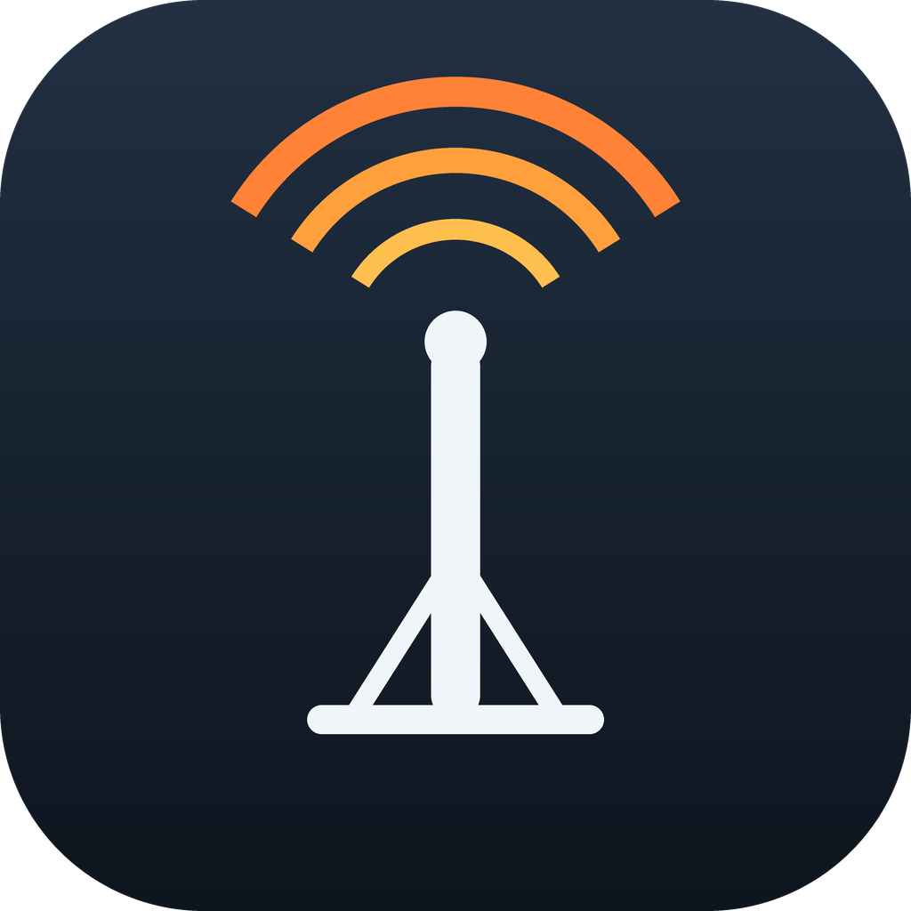

# AB6A RigCtl



A macOS menu bar app that finds your radios and runs a
[Hamlib](https://hamlib.sourceforge.net/html/rigctl.1.html) `rigctld` daemon for
each one — so WSJT-X, fldigi and logging software have something to connect to,
without you starting daemons by hand.

Ships with a terminal equivalent (`ab6a-rigctl`) that shares the same
configuration.

## Hamlib is required

This does not bundle Hamlib and will not work without it:

```sh
brew install hamlib
```

Hamlib provides `rigctld` — the daemon this launches, supervises and reads from —
and the rig model table (`rigctl -l`) used to identify your radio. It does *not*
link `libhamlib`; it speaks the rigctl network protocol over a plain socket, so
it has no third-party dynamic dependencies.

Developed and tested against **Hamlib 4.7.2**. Backend maturity varies by radio —
an IC-7760 is *Alpha* in 4.7.2, which the model picker shows you.

## Help

Questions or problems: **AB6A.US@gmail.com**

## Why

`rigctld` has to be started by hand with the right model number, the right
`/dev/cu.usbmodem*` path and a free TCP port — and that device path changes
whenever a radio is plugged into a different USB port. This keeps those details
in a profile and works the device out for you each time.

## Download

A compiled build is on the
[releases page](https://github.com/djsincla/ab6a-rigctl/releases/latest) —
Apple Silicon, macOS 26 or later. It is signed with a Developer ID and notarized
by Apple, with the ticket stapled, so it opens normally with no right-click or
quarantine step.

You still need Hamlib for `rigctld`: `brew install hamlib`.

## Build from source

```sh
brew install hamlib          # provides rigctld and libhamlib
./build-app.sh --install
```

Installs `/Applications/AB6A RigCtl.app` and puts `ab6a-rigctl` on your PATH.
The app lives in the menu bar with no Dock icon. Both share one
`~/.config/ab6a-rigctl/profiles.json`, so they cannot disagree about your radios.

Requires macOS 26 and Xcode's Swift toolchain to build. Pillow is needed only to
regenerate the icon (`make-icon.py`); the app itself has no third-party runtime
dependencies beyond Hamlib.

## Using it

Click the menu bar icon:

```
IC-7760            Icom IC-7760
   ● main            port 4532
        14.321.000 MHz  PKTUSB
   ○ second          port 4533
────────────────────────────────
Configure radios…
────────────────────────────────
Start all connected
Stop all
```

Each daemon has a toggle. **Configure radios…** is where you name a radio, pick
its Hamlib model, baud rate and CI-V address, choose which of its interfaces
carry a daemon, and set each daemon's TCP port.

### Radios, interfaces and daemons

A radio is not the same thing as a serial interface. The IC-7760 presents two
interfaces over one USB cable, and both answer CI-V — that is one radio running
two daemons, not two radios. The app models it that way: pick the *radio*, then
choose which of its interfaces get a daemon, each on its own port.

**An interface is never shared.** Exactly one daemon owns each interface. This is
enforced, not warned about, and it is an easy rule to underestimate: two daemons
on one interface *appear* to work. Measured on an IC-7760 at 60 concurrent reads
each, about 3% of transactions came back as `RPRT -9` / `RPRT -20` protocol
errors and the rest looked fine — and that was read-only traffic. Across two
different interfaces the same test was clean. Silent, intermittent corruption is
worse than an outright failure.

Interfaces are labelled by their USB `bInterfaceNumber`, which is why an
IC-7760's two serial ports read as **interface 1** and **interface 3** rather
than 1 and 2. A CDC-ACM radio spends two USB interfaces on each serial port —
one for control, one for data — and only the data interface carries a `/dev`
node. Nothing is missing: interface 2 is the control channel for the second
port.

### Radios that cannot identify themselves

A radio plugged in over native USB reports who it is. An IC-7760 is recognised as
Hamlib model 3092 without being told — not by probing, which Hamlib does not do,
but by reading the radio's own USB descriptor and matching it against the model
table.

A radio behind a generic USB-serial adapter (CP2102, FT232, PL2303) cannot do
that: the adapter reports *itself*, and says nothing about the radio. Those
appear once you tick **Show all serial devices** in the configuration window,
and you set the radio name, model and baud rate by hand.

### Device paths that move

Profiles are keyed on the USB fingerprint — vendor id, product id, serial number
and interface number — not on the `/dev` path. Plug the radio into a different
port, or a different hub, and it is still recognised; the new path is picked up
at start.

## Command line

```
ab6a-rigctl                    interactive manager
ab6a-rigctl devices [--all]    list attached radios
ab6a-rigctl list | status      saved radios and whether they are running
ab6a-rigctl start [name|all]   a radio name starts every daemon on it
ab6a-rigctl stop  [name|all]   stop daemons
ab6a-rigctl restart [name]
ab6a-rigctl models [search]    search the Hamlib model list
```

## Why a daemon, and why no Hamlib library

WSJT-X and logging software connect to `localhost:4532` and speak the rigctld
network protocol — the daemon is the product, not an implementation detail. An
app that drove the radio in-process through `libhamlib` would hold the serial
interface open and give those programs nothing to connect to, while becoming a
second owner of a line that already has one. Replacing `rigctld` would mean
reimplementing its TCP server.

The app therefore links **no Hamlib library at all**. It runs `rigctld` and
speaks the rigctl protocol to it over a plain socket to read frequency and mode
for the menu. Linking `libhamlib` for `f` and `m` would have meant a C shim
(Hamlib's API is largely function-like macros, which Swift cannot import) plus
bundling and re-signing `libhamlib` and `libusb` to satisfy hardened-runtime
library validation — a lot of machinery for two commands.

One consequence worth having: the app has no third-party dynamic dependencies,
so it signs and notarizes without any library-validation exemption.

## Layout

| Path | What |
|---|---|
| `app/` | the menu bar app (Swift, AppKit) |
| `ab6a-rigctl` | the CLI (Python 3, standard library only) |
| `make-icon.py` | regenerates `RigCtl.icns` (needs Pillow, build time only) |
| `build-app.sh` | builds the app bundle; `--install` puts it in `/Applications` |
| `notarize.sh` | submits the signed build to Apple and staples the ticket |
| `docs/` | the project page |
| `~/.config/ab6a-rigctl/profiles.json` | saved radios |
| `~/.local/state/ab6a-rigctl/` | per-daemon pid and log files |

## Licence

GPL-2.0-or-later — the same licence Hamlib applies to its own programs
(`rigctl`, `rigctld`). See [LICENSE](LICENSE) and [NOTICE](NOTICE).

Hamlib is a separate work, installed separately, and is dual-licensed:
`libhamlib` is LGPL-2.1-or-later.
